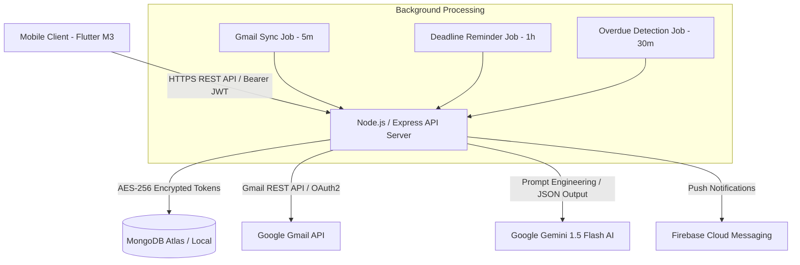
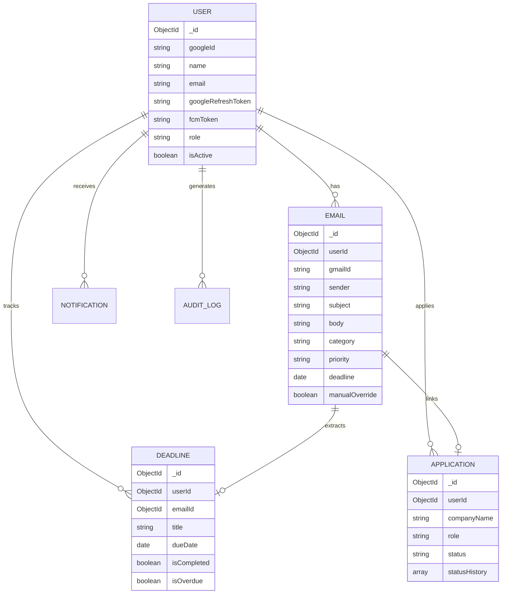

# MailGuard System Architecture & Engineering Specifications

## 1. Executive Summary
MailGuard is an AI-powered Gmail priority assistant designed specifically for final-year university students. It leverages Google Gemini AI (`gemini-1.5-flash`) to automatically analyze, classify, and prioritize incoming emails into student-centric categories (**Placement**, **Academic**, **Personal**, **Promotions**, and **Others**). Furthermore, it automatically extracts strict deadline dates and action items, tracks job applications with timeline history, and delivers push notifications via Firebase Cloud Messaging (FCM).

---

## 2. System Architecture Diagram

---

## 3. Tech Stack Specification

| Tier | Component | Technology | Rationale / Choice |
| :--- | :--- | :--- | :--- |
| **Mobile Client** | Framework | **Flutter (3.19+)** | Cross-platform native performance, Material 3 design system support |
| | State Management | **Riverpod (2.5+)** | Compile-safe dependency injection & state management |
| | Navigation | **GoRouter (13.2+)** | Declarative route definition with authentication guards |
| | Network | **Dio (5.4+)** | Interceptor support for automatic JWT refresh & logging |
| | Security Storage | **FlutterSecureStorage** | AES-encrypted SharedPreferences (Android) / Keychain (iOS) |
| **Backend Server** | Framework | **Node.js (v20+) & Express** | Lightweight, high throughput, non-blocking async I/O |
| | Database | **MongoDB (v7.0) with Mongoose** | Flexible document model with text-search & compound indexing |
| | AI Engine | **Google Gemini 1.5 Flash** | Low latency LLM with JSON output schema enforcement |
| | Security & Auth | **JWT & Crypto-JS** | Stateless JWT authentication + AES-256 encryption for refresh tokens |
| | Background Jobs | **Node-Cron** | Automated email polling, deadline checks, and overdue marking |
| **Deployment** | Containerization | **Docker & Docker Compose** | Multi-stage lightweight builds with non-root security |

---

## 4. Data Models Schema Design

---

## 5. Security & Privacy Blueprint
1. **Bank-Grade Token Encryption**: Google Refresh Tokens are encrypted using AES-256 before being persisted into MongoDB.
2. **Stateless JWT Rotation**: Short-lived access tokens (15 minutes) paired with 7-day refresh tokens.
3. **Data Isolation**: All MongoDB queries are scoped to `req.userId` extracted from validated JWT claims.
4. **Audit Trail**: Operational actions are asynchronously logged in `AuditLog` collection with a 1-year TTL index.
